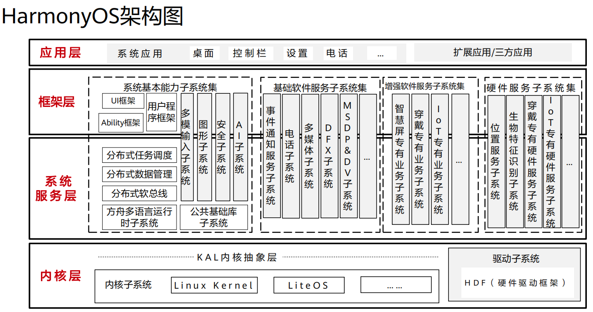

## 概念

## 典型应用场景
1. 全新办公模式

2. 业务流转   

## HarmonyOS架构
### 架构图  
  
### 解析如下：
> 横向分为(从底往上)  
1. 内核层（内核和驱动部分）  
> 内核部分解析
* 分为内核层和驱动层两个部分
* 多内核设计，使用KAL来适配连接多个内核，满足多种设备level的需求
* 目前支持的三种内核：liteos-m,liteos-a,linux kernel
* 进程，线程，内存管理，文件系统等是kernel内部的事情，HCIA认证主要关心的是liteos_m内核

> 驱动部分介绍
* 通过平台，系统接口解耦的构建统一的驱动平台底座兼容如Linux，LiteOS等不同内核
* 支撑百K级到G级容量的1+8+N的设备部署
* 根据不同设备形态，支持用户台部署和内核台部署

> 驱动部分解析
* 开放的硬件生态
* 统一外设访问能力
* 驱动开发框架和驱动管理框架
* 深入理解驱动框架（基于Linux驱动框架）

2. 系统服务层
3. 框架层
4. 应用层  

> 纵向(从左往右)
1. 系统基本能力子系统集  
2. 基础软件服务子系统集
3. 增强软件服务子系统集
4. 硬件服务子系统集  

> 按功能（纵向）
1. 系统 > 子系统集 > 子系统 > 功能/模块 逐级展开
2. 在多设备部署场景下，支持根据实际需求裁减某些非必要的子系统或功能/模块

> 总结  
1. 横向分四层(内核层，系统服务层，框架层，应用层)
2. 纵向分三到四层(系统 > 子系统集 > 子系统 > 功能/模块)

## HarmonyOS的安全
1. 安全的含义  
* 正确的人，通过正确的设备，正确地使用数据  

2. TEE环境 
* TEE, Trusted Execution Environment,即可信执行环境
* REE，Rich Excution Environment，即所有移动设备通用的环境，运行通用的OS
* TEE需要硬件支持，不是纯软件能实现的
* 可以简单理解为整个系统由TEE和REE两部分组成，TEE是绝对安全的，REE只能通过受限API来访问TEE。

3. PKI证书
* 通信中数据靠加密，分为对称和非对称加密
* 对称加密的话，由于密钥无法告知对方(如果传输的话，也可能被截获，这样不安全)，所以一般来说，非对称加密更合适些
* 理解对称和非对称加密算法
* PKI，Public Key Infrastructure，公开密钥基础设施，指的是证书的制作和分发的一种机制。PKI基础技术包括加密，数字签名，数据完整性机制，数字信封，双重数字签名等。

4. 总结  
HarmonyOS设备认证和互信，是基于华为账号系统的。  

* 正确的人  
通过身份认证的数据访问者或者业务操作者；确保用户数据不被非法访问，用户隐私不泄露的前提条件，通过下面三方面确保“正确的人”：
1. 协同互助认证：让高安全等级的设备协助低安全等级设备完成用户认证。
2. 零信任模型：当用户需要跨设备访问数据资源或者发起超高安全的等级的业务(例如，对安全设备的操作时)，HarmonyOS会对用户进行身份认证，确保其身份的可靠性。
3. 多因素融合认证：通过用户身份管理，将不同设备上标识同一用户的认证凭据关联起来，用于标识一个用户，来提高认证的准确度。  

* 正确的设备
1. 设备证书认证：支持为具备可信任执行环境的设备预置设备证书，用于向其他虚拟终端证明自己的安全能力。
2. 安全启动：
* 确保源头每个虚拟设备运行的系统固件和应用程序是完整的、未经篡改的。
* 通过安全启动，各个设备厂商的镜像包就不易被非法替换为恶意程序，从而保护用户的数据和隐私安全。
3. 可信执行环境： 提供了基于硬件的可信任环境(TEE)来保护用户的个人敏感数据的存储和处理，确保数据不泄露。

* 正确的使用数据  
1. 生成  
对数据分类分级，根据分类设置相应的保护等级。
2. 存储  
通过区分数据的安全等级，存储到不同安全防护能力的分区。
3. 使用  
通过硬件为设备提供可信执行环境。
4. 传输  
建立安全的连接通道和安全的加密传输通道。
5. 销毁  
销毁密钥即销毁数据。数据在虚拟终端的存储，都建立在密钥的基础上。  

## HarmonyOS关键特性

## HarmonyOS生态 