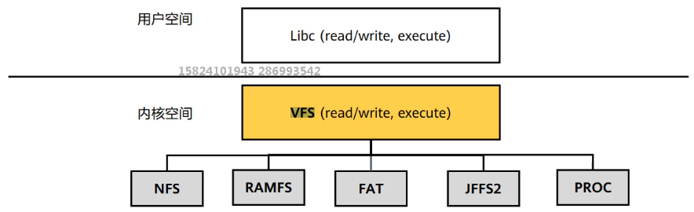
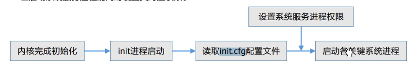
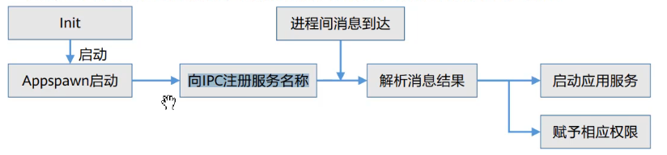

## 概念

## 典型应用场景
1. 全新办公模式

2. 业务流转   

## HarmonyOS架构
### 架构图  
  
### 解析如下：
> 横向分为(从底往上)  
1. 内核层（内核和驱动部分）  
> 内核部分解析
* 分为内核层和驱动层两个部分
* 多内核设计，使用KAL来适配连接多个内核，满足多种设备level的需求
* 目前支持的三种内核：liteos-m,liteos-a,linux kernel
* 进程，线程，内存管理，文件系统等是kernel内部的事情，HCIA认证主要关心的是liteos_m内核

> 驱动部分介绍
* 通过平台，系统接口解耦的构建统一的驱动平台底座兼容如Linux，LiteOS等不同内核
* 支撑百K级到G级容量的1+8+N的设备部署
* 根据不同设备形态，支持用户台部署和内核台部署

> 驱动部分解析
* 开放的硬件生态
* 统一外设访问能力
* 驱动开发框架和驱动管理框架
* 深入理解驱动框架（基于Linux驱动框架）

2. 系统服务层
3. 框架层
4. 应用层  

> 纵向(从左往右)
1. 系统基本能力子系统集  
2. 基础软件服务子系统集
3. 增强软件服务子系统集
4. 硬件服务子系统集  

> 按功能（纵向）
1. 系统 > 子系统集 > 子系统 > 功能/模块 逐级展开
2. 在多设备部署场景下，支持根据实际需求裁减某些非必要的子系统或功能/模块

> 总结  
1. 横向分四层(内核层，系统服务层，框架层，应用层)
2. 纵向分三到四层(系统 > 子系统集 > 子系统 > 功能/模块)

## HarmonyOS的安全
1. 安全的含义  
* 正确的人，通过正确的设备，正确地使用数据  

2. TEE环境 
* TEE, Trusted Execution Environment,即可信执行环境
* REE，Rich Excution Environment，即所有移动设备通用的环境，运行通用的OS
* TEE需要硬件支持，不是纯软件能实现的
* 可以简单理解为整个系统由TEE和REE两部分组成，TEE是绝对安全的，REE只能通过受限API来访问TEE。

3. PKI证书
* 通信中数据靠加密，分为对称和非对称加密
* 对称加密的话，由于密钥无法告知对方(如果传输的话，也可能被截获，这样不安全)，所以一般来说，非对称加密更合适些
* 理解对称和非对称加密算法
* PKI，Public Key Infrastructure，公开密钥基础设施，指的是证书的制作和分发的一种机制。PKI基础技术包括加密，数字签名，数据完整性机制，数字信封，双重数字签名等。

4. 总结  
HarmonyOS设备认证和互信，是基于华为账号系统的。  

* 正确的人  
通过身份认证的数据访问者或者业务操作者；确保用户数据不被非法访问，用户隐私不泄露的前提条件，通过下面三方面确保“正确的人”：
1. 协同互助认证：让高安全等级的设备协助低安全等级设备完成用户认证。
2. 零信任模型：当用户需要跨设备访问数据资源或者发起超高安全的等级的业务(例如，对安全设备的操作时)，HarmonyOS会对用户进行身份认证，确保其身份的可靠性。
3. 多因素融合认证：通过用户身份管理，将不同设备上标识同一用户的认证凭据关联起来，用于标识一个用户，来提高认证的准确度。  

* 正确的设备
1. 设备证书认证：支持为具备可信任执行环境的设备预置设备证书，用于向其他虚拟终端证明自己的安全能力。
2. 安全启动：
* 确保源头每个虚拟设备运行的系统固件和应用程序是完整的、未经篡改的。
* 通过安全启动，各个设备厂商的镜像包就不易被非法替换为恶意程序，从而保护用户的数据和隐私安全。
3. 可信执行环境： 提供了基于硬件的可信任环境(TEE)来保护用户的个人敏感数据的存储和处理，确保数据不泄露。

* 正确的使用数据  
1. 生成  
对数据分类分级，根据分类设置相应的保护等级。
2. 存储  
通过区分数据的安全等级，存储到不同安全防护能力的分区。
3. 使用  
通过硬件为设备提供可信执行环境。
4. 传输  
建立安全的连接通道和安全的加密传输通道。
5. 销毁  
销毁密钥即销毁数据。数据在虚拟终端的存储，都建立在密钥的基础上。  

## HarmonyOS关键特性
* 硬件互助，资源共享
1. 分布式软总线：是基础，是底层通信机制(WIFI,BLE等)的软件层包装和管理。  
2. 分布式任务调度：跨设备对应用进行远程启动，远程调用，远程连接以及迁移。
3. 分布式数据管理:业务和数据分离、跨设备生产、存储和使用数据和本地一样方便。
4. 分布式文件管理(没有体现):跨设备访问文件和访问本地文件一样   
5. 分布式虚拟化设备:分布式在系统应用层从效果出发的描述。  

总结：1是提供一个管道，是WIFI，BLE等的软件层的包装和管理，2，3，4是中间层，是系统服务层，5的话是上层

* 一次开发，多端部署
1. 这里指的是应用开发，不是南向设备固件开发
2. 应用开发IDE提供相应模板和机制，便于app开发者开发场景式app
3. HarmonyOS应用云市场提供相应签名，分发等机制，确保app合理组成hap，再部署到独立设备中
4. FA和PA保证了app的可分发，可运行，分布式特性保证了跨设备和设备内一样的编程方法和使用体验
5. 各独立设备运行HarmonyOS，保证了端侧hap的适配和执行  
6. 提供了用户程序框架，Ability框架和UI框架，支持应用开发过程中多终端的的业务逻辑和界面逻辑进行复用
7. UI框架支持Java和JS两种语言

* 统一os，弹性部署
1. 此处说的不是北向应用开发，是南向设备开发
2. HarmonyOS从源码结构，软件工具，业务流程等方面会提供支撑，让设备商弹性部署HarmonyOS
3. 理解统一OS弹性部署的含义即可  
4. 实现弹性部署，我们需要：
> a.硬件的形态和需求，可以选择所需的组件(组件可有可无)  
> b.硬件的资源情况和功能需求,可以选择配置中的组件功能集(组件可大可小)
> c.根据编译链关系，去自动化生成组件化的依赖关系(平台可大可小)

* 官网资料
1. https://device.harmonyos.com/cn/docs/start/learn/overview-features-0000001157881877

## HarmonyOS生态 
* 共建圈
1. 先行者计划
2. 闭门会议
3. codelab 
4. hackthon
5. meet up
6. work shop
7. 总裁面对面

* 学习圈
1. 直播
2. 评测
3. 课程培训
4. 技术专家
5. 文档资料
6. 技术文章

## 设备开发入门
1. 环境搭建和新项目创建过程
* 
* 
* 

2. OpenHarmony的目录结构，CMSIS和POSIX的概念
* OpenHarmony的整体目录结构如下图：  
 
> 共有16个1级目录文件夹  
* applications 主要存放用户的应用程序
* base目录是HarmonyOS Framework的基础能力集合，定位了大多数设备开发需要的能力模块
* build 组建化编译和构建
* developtools 开发工具
* device 设备相关文件
* docs 说明文档
* domains 增强软件服务子系统
* drivers 驱动
* foundation 系统基础能力
* kernel 内核子系统
* out 编译输出件
* prebuilts 编译器及工具子系统
* test 测试子系统
* third_party 开源第三方组件
* untils目录作为公共基础库，存放通用的基础组件
* vendor 厂商提供的软件  

> CMSIS和POSIX的介绍(OS kernel和应用程序之间的接口)
* CMSIS接口  
1. Cortex Microcontroller Software Interface Standard
2. ARM专为Cortex-M系列单片机设计的为控制软件接口标准
3. CMSIS有多个分支，鸿蒙用的主要是

* POSIX接口
1. 基于Linux平台的接口，不支持rtos
2. 文件系统包括虚拟文件系统，网络文件系统，文件配置表等内容
3. 扩展内核：异常管理，动态加载等
4. 基础内核：时间管理，内存管理，IPC通信，任务同步，硬件管理，任务调度

## 组件开发与hpm
* HarmonyOS组件开发就是用了模块化的开发思想：独立的小组件拼接为一组组件，再次编译打包构成带有完整系统景象的发行版
* HPM是HarmonyOS Package Manager，鸿蒙包管理。主要功能为：下载源码，执行安装，编译，打包，升级操作。

## 内核基础
* 两个级别的内核
> linux类内核:有mmu和虚拟地址  
> rtos类内核：无mmu和虚拟地址  

* 进程与线程：
>  进程：linux类系统有
>  线程：linux类系统有
>  任务：rtos一般只有任务的概念  

* 操作系统调度：
> 非抢占式和抢占式，进程/线程/任务的优先级(越小越高)
> 时间片，时间片轮训调度  

* 几个重要概念
> 同步和异步  
> 阻塞和非阻塞  
> 临界区和保护  
> 进程/线程/任务间通信  
> 进程/线程/任务间同步  

## HarmonyOS的进程与线程
* HarmonyOS进程基本概念
1. HarmonyOS内核中的进程采用抢占式调度机制，支持时间片轮转调度方式
2. 共有0-31的进程优先级，0最高，31最低。用户进程可配置的优先级有22个(10-31个)，内核进程优先级范围是0-9。
3. 高优先级抢占低优先级进程，低优先级进程必须等待高优先级进程释放CPU资源。
4. 每一个用户态进程均拥有自己独立的进程空间，相互之间不可见，进程之间相互隔离
5. 用户态根进程init由内核态创建，其他用户进程均由init进程fork而来  

> 进程状态迁移-进程插队场景
1. 考虑单核CPU的情况，在进程1的执行过程中，进程2插队执行。
2. 进程1的状态流转：  init->ready->running->ready->running->zombies
3. 进程2的状态流转：  
init->ready->running->zombies

> 高优先级进程是否一定能抢占低优先级进程
1. 如果任何时候高优先级进程都会抢占低优先级进程，则会出现异常
2. 需要一种"保护机制"，确保程序的执行结果不出现异常，这种机制称为"锁"  

* 进程防冲突和负载均衡
> 进程防冲突(锁)
1. 多核CPU进程防冲突用自旋锁(自旋锁是阻塞式的设计，不会睡眠)
2. 

> 负载均衡
1. 负载均衡为了提升效率，为了让多个CPU核心之间尽量平均分配

> 线程状态迁移
1. 在同一个进程，在线程1的执行过程中，优先级更高的线程2插队执行
2. 线程1：  
init->ready->running->ready->running->exit
3. 线程2:  
init->ready->running->exit  
4. HarmonyOS采用2种方式来高效管理线程：任务池和就绪队列

> HarmonyOS内核的线程管理
1. 内核管理线程靠任务池(默认128个任务，常驻内存)和就绪队列(默认32条队列)
2. 不同优先级的多个任务都处于ready并不会使用优先级队列，因为直接抢占即可。
3. HarmonyOS有32条队列，不是32个队列，对应0-31个共32个优先级，每个优先级都有自己的就绪队列，每个队列的格子数都是不固定的，可以理解为内部用链表实现。

> HarmonyOS内核线程的调度算法
1. 执行靠调度算法
2. 线程管理的调度算法也是用抢占式调度机制，优先级高的可以抢占优先级低的。
3. 如果是同一个优先级的多个任务ready，则有两种策略:fifo(SCHED_FIFO)和时间片(SCHED_RR，时间片默认是10ms)  

> HarmonyOS线程常用的锁机制
1. 互斥锁
* 未得到资源的线程将不会占用CPU资源
* 多核上面采用自旋锁来保护资源
* 
2. 读写锁(共享-独占锁)
* sample1
 

## HarmonyOS的内存管理
1. liteos-m 没有mmu
2. liteos-a 存在mmu
3. HarmonyOS内存分为四个区域：代码区，静态区，堆区，栈区
4. HarmonyOS将内存分为用户空间和内核虚拟空间，通过MMU对虚拟内存进行管理调度

## HarmonyOS的网络机制
1. 网络模块基本实现了TCP/IP的协议栈，提供标准的POSIX socket接口
2. liteos-m系统使用LwIP提供网络能力

## HarmonyOS的文件系统
1. 文件系统分为：
* VFS：虚拟文件系统。它不是一个实际的文件系统，而是一个异构文件系统之上的软件粘合层，为用户提供统一的类Unix文件操作接口。
 
* NFS：网络文件系统。通过网络让不同的主机共享文件。
1. 创建NFS目录与文件默认使用777权限
2. 当前NF可支持TCP与UDP两种协议，默认使用TCP
* RAMFS：基于RAM的动态文件系统。作为一种缓冲机制，减少存储器的读写损耗，提高读写效率。
* FAT：文件配置表。用于可移动存储介质，使设备和桌面系统有较好兼容性。
1. 配置表有FAT12，FAT16，FAT32三种，它将硬盘分为MBR，DBR，FAT，DIR，DATA五个区
2. FAT特性：支持多种介质，尤其在可移动存储设备上使用广泛。FAT具有代码量和资源占用小、可裁切、支持多种物理设备、读写指针不分离的特性。
* JFSS2：日志型文件系统。主要对NOR_FLASH闪存的文件管理。

## 其他内核基础知识
1. 软件定时器
* 制定任务循环执行的周期，用作任务的延迟执行。
* 在HarmonyOS内，swtmrTask.usTaskPrio = 0,软件定时器拥有最高的线程优先级。

2. 信号量
* 可以实现任务间通信，可以实现任务间同步或共享资源的互斥访问。
* HarmonyOS最大的信号量个数为1024个，信号量的任务列表是一个双向链表。

3. 事件机制event
* 任务间通讯机制，常用于任务间的同步
* 一对多模型和多对多模型

4. 锁的优先级翻转异常与解决
 
* HarmonyOS临时提升低优先级的任务优先级来实现优先级翻转

5. HarmonyOS的消息队列
* 常用于消息的异步处理，消息的缓冲
* 消息发送方与消息接受方实现解耦
* HarmonyOS消息队列最大消息内容1KB，POSIX最大消息内容64字节；
* HarmonyOS最大消息数量256个，POSIX最大消息数量16个

## HarmonyOS的驱动模型
1. 驱动介绍
* 驱动设备的分类
> 字符设备:按照字节传输 液晶显示器，串口，LED，蜂鸣器，触摸屏  
> 块设备：按照块传输 硬盘，NandFlash，iNand，SD
> 网络设备：网络传输 网卡驱动  

2. 驱动框架
* 
* 
*   

3. HDF驱动模型
> 驱动模型
* 为驱动开发者提供驱动框架能力，包括驱动加载，驱动服务管理和驱动消息机制管理。
* 力争做到一次开发，多系统部署。
* HDF框架将一类设备驱动放在同一个host里面，支持一个驱动多个node。

> HDF框架特点
* 弹性化的框架
* 组件化的驱动模型
* 规范化的驱动平台
* 归一化的平台底座
* 归一化的配置界面
* 驱动动态安装
1. preload字段配置加载方式，0 默认启动 1 快速启动后启动 2 动态加载，系统起来后需要加载再加载
2. 

> HDF驱动开发
1. 基于HDF框架进行驱动的开发主要分为两个主要部分：驱动实现和驱动配置。
2. 描述文件用hcs后缀描述，用kv方式存储
3. 描述文件是多个host，每个host中有多个device，每个device中有多个node组成
 
4. 配置代码和驱动代码解耦

> 驱动平台介绍
1. RTC：可以为操作系统提供精准的实时时间和定时报警功能
2. SPI：
3. SDIO：
4. WATCHDOG：
5. ADC: 模数转换，它的过程经过：采样，量化，编码三个过程。编码值（0-255）  电压值（0-3.3V）  物理量值(0-33度) 
6. PWM： 脉冲宽度调制

## HarmonyOS的子系统
1. 编译构建
> 编译构建子系统是什么
* 构建已有产品
* 独立构建芯片厂商源码
* 独立构建单个组件  

> Ninja和Gn概述
* ninja(等效于make)是一个专注于速度的小型构建系统
* gn(等效于cmake)：Generate ninja的缩写，用于产生ninja文件，开发者主要写gn的配置文件。
* 

> 编译构建原理
> 设置和编译
2. 分布式远程启动
3. 公共基础与ota升级
4. 启动恢复
5. 软总线

> 鸿蒙的hb
1. hb是鸿蒙专为build开发的一个工具软件，就是HarmonyOS Build。
2. hb的用法是hb cmd arg，有多个cmd
3. hb set 命令从来设置编译的鸿蒙源码目录
4. hb build -f 用来编译构建选中的开发板
5. 编译实现过程如下所示：
 

## HarmonyOS的功能调测
1. 分布式远程启动
2. 启动恢复
> 启动恢复子系统负责从内核启动之后到应用启动之前的系统关键服务进程的启动过程以及设备恢复出场设置的功能  
> 涉及以下组件
* Init启动引导组件
1. 主要功能：Init启动引导组件负责在系统启动阶段启动关键服务进程，若用户需要新增随开机自启动的系统服务，可将新增服务加入配置文件init.cfg中。
2. 运行机制：Init启动引导组件对应的进程为init进程，是内核完成初始化后启动的第一个用户态进程。init进程启动之后，读取init.cfg配置文件，根据解析结果，执行相应命令并依次启动各关键系统服务进程，在启动系统服务进程的同时设置其对应权限。  
 

* Appspawn启动引导组件
1. 主要功能：负责接收用户程序框架的命令，孵化应用进程，设置新进程的权限，并调用应用程序框架的入口函数。
2. 运行机制：Appspawn被Init启动后，向IPC框架注册服务名称，之后等待接收进程间消息，根据消息解析结果启动应用服务并赋予其对应权限。
 

* Bootstrap服务启动组件
1. 主要功能：提供各服务和功能的启动入口标识。在SAMGR(系统服务框架子系统)启动时，会调用boostrap标识的入口函数，并启动系统服务。
2. 主要特点：实现了服务的自动初始化，即服务的初始化函数无需显示调用，而是将其使用宏定义的方式申明，就会在系统启动时，
3. 实现原理

* Syapara系统属性组件
1. 
2. 

* Startup启动组件  
1. 
2. 

3. 软总线和图形图像子系统
> 软总线
1. 连通的是1+8+N的独立设备。
2. 自发现，自组网，高带宽，低延时

> 图形图像子系统
1. 提供了基础UI组件和容器类组件
2. 提供截屏、导出组件树的能力
3. 模块内部实现组件渲染、动画、输入事件分发等功能。
> AI框架
1. 插件管理
* 实现插件的生命周期管理
* 实现插件按需部署
* 快速集成AI能力插件
2. 模块管理
* 任务调度
* 管理客户端的实例
3. 通信管理
* 客户端与服务端的跨进程通信
* 引擎与插件之间的数据传输
4. 运行机制（包含client,server和common三个主要模块）
* client提供server端链接管理功能
* server提供插件加载以及任务管理等功能，各pluging实现由server提供的插件接口，完成插接接入。
* common提供与平台相关的操作方法、引擎协议以及相关工具类，供其他个模块调用。  

> Sensor服务框架与用户程序框架
1. 传感器列表查询
2. 传感器控制
3. 传感器订阅去订阅等功能
4. Sensor服务框架结构：
* Sensor API：提供传感器的基础API。主要包含查询传感器的列表、订阅/取消传感器数据、执行控制命令等，简化应用开发
* Sensor Framework：主要实现传感器的订阅管理、数据通道的创建、销毁等，实现与传感器服务层的通信。
* Sensor Service：主要实现HDF层数据接受、解析、分发，对设备传感器的管理，数据上报管理以及传感器权限管控等。
5. 用户程序框架结构
* Ability：系统调度应用的最小单元，是能够完成一个独立功能的组件，一个应用可以包含一个或多个Ability。分为：Page类型的Ability和Service类型的Ability。
Page类型的Ability(FA/PA)：带有界面，为用户提供人机交互的能力
Service类型的Ability(SA)：不带界面，为用古提供后台任务机制。

> 安全和测试
1. 应用可信
2. 权限管理
3. 设备可信
4. HarmonyOS安全子系统子功能：应用验签，应用权限管理，IPC通信鉴权，可信设备群组
5. 安全子系统限制
* 仅支持以下三类应用的验签：应用市场调试应用、应用市场发布应用、HarmonyOS自签名应用的验签。
* 若对应用市场调试应用验签，则本机UDID需要在描述文件包含的UDID列表中。
* 待上架应用无法验签通过
* 验签组件提供的接口都位于security_interfaces_innerkits_app_verity仓app_verify_pub.h中，仅支持系统应用开发者调用。
* 可信设备群组管理接口，目前只对系统签名权限才可以使用。
6. HarmonyOS 测试子系统
* 基于Python开发的一键式的开发自测试平台，支持跨平台使用以及三方测试框架拓展，主要包括用例编译，测试用例管理，测试用例调度分发，测试用例执行，测试结果收集，测试报告生成，测试用例模板，测试环境管理等模块。
* 功能与限制：
1. 功能使用范围：开发自测试平台仅支持代码级的测试用例开发和验证，如单元测试，模块测试。
2. 规格限制：当前测试框架的适用范围仅支持白盒测试。
3. 操作限制：一台测试设备上仅支持启动单个测试平台。

> DFX与XTS
1. 
2. 
3. 
